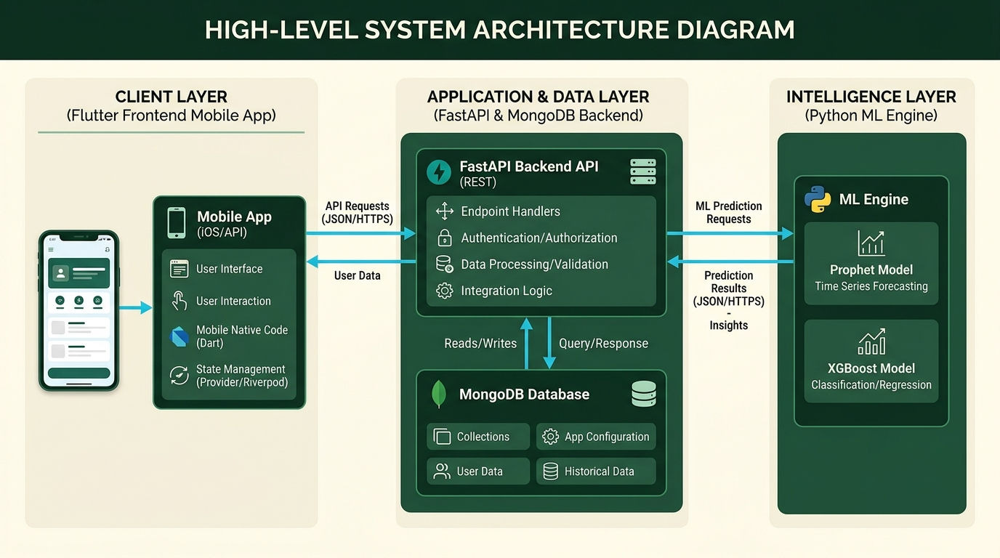
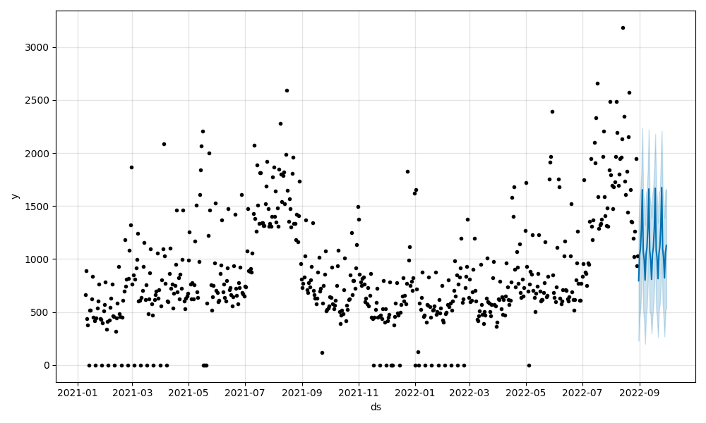
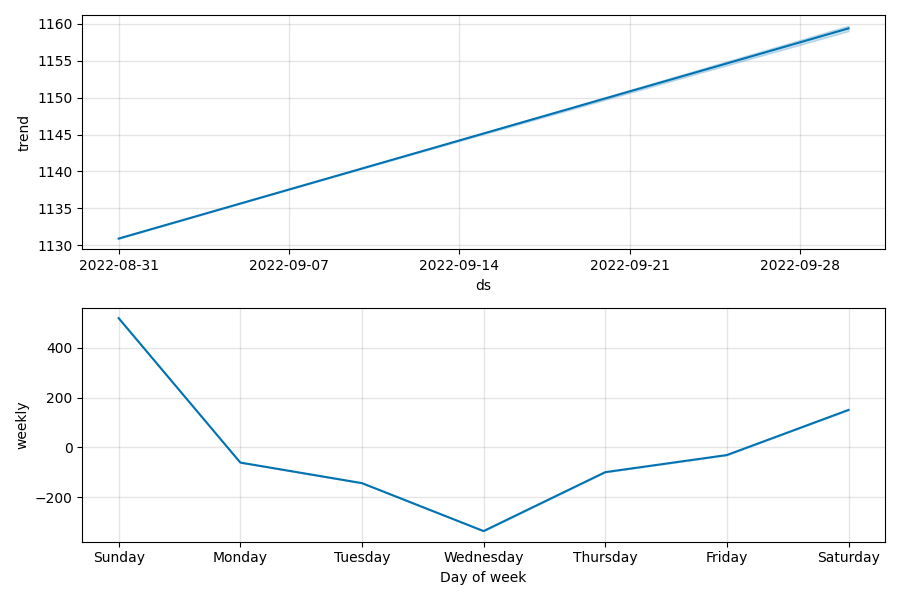

# RestockIQ 🥐📉

**RestockIQ** is an end-to-end, AI-powered inventory forecasting and waste-reduction platform built specifically for non-technical cafe, bakery, and local retail owners. 

By hiding advanced Machine Learning (Prophet + Gradient Boosting) behind a frictionless, "Warm Tech" mobile interface, RestockIQ translates complex demand forecasts into plain-language daily restock quantities. It doesn't just tell you what to order; it tells you what to do with unsold food today to maximize revenue and eliminate waste.

---

## 🏗️ High-Level Architecture

RestockIQ is built on a decoupled, batch-driven architecture designed for high-availability read speeds on mobile devices.

### 1. The Frontend (Flutter)
*   **Tech Stack:** Flutter, Dart, Firebase Auth.
*   **Design System:** **"Warm Tech"**. Off-white cream bases, deep forest greens, soft radii, and plain-language LLM explanations to minimize "math anxiety" for kitchen staff.
*   **Core Loop:** Owners check the dashboard in the morning for their exact restock/bake list, and perform a fast end-of-day check-in at closing. The app locks perishables to `0` automatically at EOD.

### 2. The Backend (FastAPI + MongoDB)
*   **Tech Stack:** Python, FastAPI, MongoDB.
*   **Role:** Acts as an ultra-fast read-layer. It does *not* execute ML inference on the fly. It reads pre-computed, structured JSON documents from MongoDB generated by the ML batch jobs.
*   **Mock-Ready:** Engineered to easily swap between mock JSON data (for parallel UI development) and real ML data.

### 3. The Machine Learning Engine

The forecasting engine is split into a **Dual-Tier Architecture** to handle both high-volume staples (croissants) and highly sparse, erratic items (specialty cakes).

#### Tier 1: Primary Items (>10 units/day)
*   **Methodology:** Prophet Decomposition + Pooled Global Gradient Boosting.
*   **How it works:** We use Facebook Prophet strictly as a feature extractor (capturing trend, weekly seasonality, country-specific holidays, and tourist seasons). Those components are fed into a single, globally pooled `HistGradientBoostingRegressor` alongside rolling lags. The trees correct Prophet's rigid mathematical overshoots using the pooled cross-item history.
*   **Performance:** Achieves a **~22.75% WAPE** on out-of-sample data, beating 7-Day Moving Averages by ~9 points and Seasonal Naive by ~12 points.

#### Tier 2: Sparse Items (<10 units/day & New Items)
*   **Methodology:** TSB (Teunter-Syntetos-Babai) + Actuarial Credibility Weighting.
*   **How it works:** Sparse retail data is zero-inflated (sells 0 most days, spikes occasionally). Standard Mean+Std breaks down here. We use the **90th percentile** of the category's daily history as a prior. As an item gains history, we fade from the category prior to the item's TSB forecast using $W = n / (n + k)$, where $k$ is calibrated to the category's volatility.
*   **Performance:** Halves the Mean Absolute Error (MAE) compared to flat category baselines (0.67 vs 1.41).

---

## 📊 Proven Business Impact (Simulation)

To validate the ML engine, we ran an inventory simulation over a 4-month summer period on real bakery data (84,500 total demand). 

**Rule:** `Restock = Forecast + Safety Stock (1.65 * Historical Std Dev)`

| Strategy | Total Waste (Units) | Stockout Days |
| :--- | :--- | :--- |
| **Seasonal Naive** | 65,026 | 275 |
| **7-Day Moving Average** | 63,759 | 179 |
| **RestockIQ (ML Engine)** | **60,483** | **137** |

**The Result:** By tightening the forecast variance, RestockIQ prevents over **3,200 units of food waste** in a single season while simultaneously **eliminating 42+ stockout days**, proving that advanced ML drives real margin expansion.

---

## 🚨 The Waste Action Engine (Intraday Markdown)

Forecasting prevents *tomorrow's* waste, but what about the food already sitting on the shelf today?

RestockIQ implements a **Waste Action Engine**. It calculates a real-time `sales_pace_ratio = actual_sales_so_far / predicted_demand_so_far`. 
If a perishable item is moving significantly slower than forecasted (e.g., `< 0.6` pace), the app fires an intraday alert recommending a specific markdown action (e.g., "Apply a 20% discount now") based on modeled price elasticity. 

---

## 📁 Repository Structure

*   `/APP/` - The Flutter mobile application source code.
*   `/ML/` - The Python forecasting pipeline, Prophet/XGBoost training scripts, and simulation testing.
    *   `ML_Development_Plan.md` - In-depth ML architecture rationale.
    *   `learning_notes.md` - Exhaustive log of ML experiments, falsifications, and final locked configurations.
*   `/Backend/` *(Upcoming)* - The FastAPI routing and MongoDB integration layers.

---

## 🚀 Getting Started

**Frontend (Flutter)**
1. `cd APP`
2. `flutter pub get`
3. `flutter run`

**ML Pipeline (Python)**
1. `cd ML`
2. `python -m venv venv`
3. `source venv/bin/activate` (or `venv\Scripts\activate` on Windows)
4. `pip install -r requirements.txt` (Ensure `prophet` and `scikit-learn` are installed).

---
*Built to make independent food retail profitable, predictable, and waste-free.*
